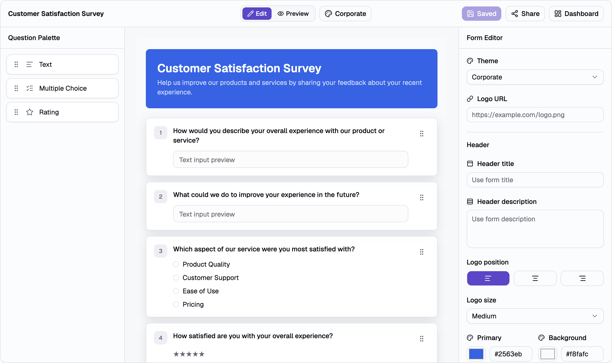

# Respondly

Respondly is a full-stack survey builder that allows users to create, manage, and share custom surveys. Users can build forms with different question types, publish them using a unique link, collect responses, and export submission data.

## Screenshots



## Features

- Secure user authentication
- Create, edit, rename, and delete surveys
- Add and manage survey questions
- Drag-and-drop question reordering
- Publish surveys with a shareable public link
- Submit responses without requiring authentication
- View collected responses
- Export responses as CSV
- Search and paginate surveys
- Responsive design for desktop and mobile
- Light and dark mode support

## Tech Stack

### Frontend

- React
- TypeScript
- Vite
- TanStack Router
- TanStack Query
- TanStack Form
- Tailwind CSS v4
- shadcn/ui
- dnd-kit
- Zustand
- Zod

### Backend

- Hono
- TypeScript
- Better Auth
- Drizzle ORM
- Cloudflare Workers

### Database

- Cloudflare D1 (SQLite)

## How It Works

1. Sign up and create an account.
2. Create a survey and add questions.
3. Share the generated public link.
4. Collect responses from participants.
5. Review submissions and response data.
6. Export responses as CSV when needed.

## Getting Started

### 1. Clone the Repository

```bash
git clone https://github.com/Dev-kaif/Respondly.git
cd Respondly
```

### 2. Install Dependencies

```bash
pnpm install
```

### 3. Configure Environment Variables

#### Frontend (`web/.env`)

Create a `.env` file inside the `web` directory:

```env
VITE_API_URL=http://localhost:8787
```

#### Backend (`api/.dev.vars`)

Create a `.dev.vars` file inside the `api` directory:

```env
BETTER_AUTH_SECRET=your-secret

BETTER_AUTH_URL=http://localhost:8787

FRONTEND_URL=http://localhost:5173

GOOGLE_CLIENT_ID=your-google-client-id

GOOGLE_CLIENT_SECRET=your-google-client-secret
```

> **Note:** Google OAuth credentials must be created in the Google Cloud Console. Ensure the authorized redirect URIs and origins match your local development setup.

### 4. Run the Application

Start both the frontend and backend from the project root:

```bash
pnpm dev
```

This will start:

* Frontend: `http://localhost:5173`
* Backend: `http://localhost:8787`

### 5. Verify the Setup

Run the following commands to ensure everything is working correctly:

```bash
pnpm check
pnpm typecheck
pnpm build
```

All commands should complete successfully without errors.
